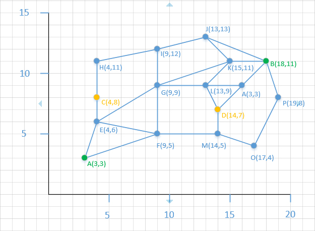
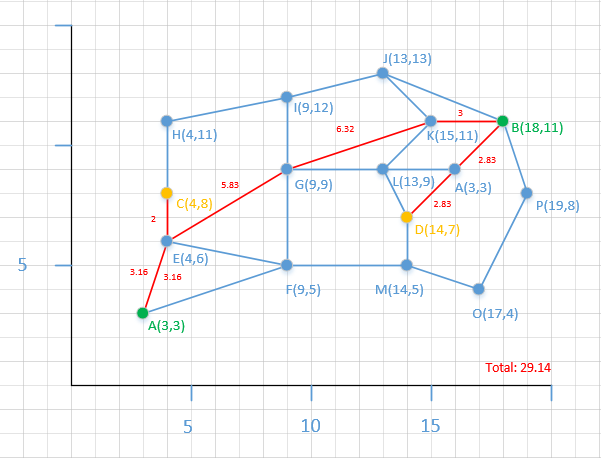
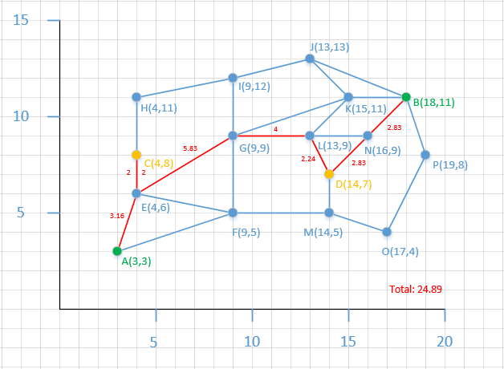

# Shortest Location Detour Pickup
**Problem**: Calculate the detour distance between two different rides. Given four latitude / longitude pairs, where driver one is traveling from point A to point B and driver two is traveling from point C to point D, write a function (in your language of choice) to calculate the shorter of the detour distances the drivers would need to take to pick-up and drop-off the other driver.

####Base Graph


####1. Create Graph
* Each one of these edges is bidrectional, however, the algorithm is set up so if the graph was only uni-directional, the optimal path would still be found. 
* Each point is assigned a value, and inputted on a Cartesional Coordinate System
* The following equation was used to find the distances from each point, and used as the weights on each edge

```

distance = Math.sqrt(Math.Pow((Math.abs(x1-x2),2) +Math.Pow((Math.abs(y1-y2),2))

```

####2. Compute Paths
* The way that Dijkstra's algorithm works, it calculates a minimum path from **Point A** to **Point B**. (For more on how Djisktra's algorithm works, you can view [this YouTube video](https://www.youtube.com/watch?v=8Ls1RqHCOPw) as I found it exremely invaluable). 
* The fundamental data structure that I used was a PrirorityQueue, which is not only a LIFO datastructurebut also rearranges elements by value. 

* Now becuase the problem presents a total of 4 points, the algorithm had to first calculate sub routes between each sub-route point.

If Started with **A**:
```
A --> C = A_C
C --> D = C_D
D --> B = D_B
```

If Started with **B**:
```
C --> A = C_A
A --> B = A_B
B --> D = B_D
```

####3. The Algorithm
* Because this Djikstra's algorthim works by first calculating **ALL** distances from the starting point, the routes that start with the same letter (e.g. A --> C and A -->B) didn't need to be repeated. This means that Djiskatra's was run only 4 times, being the number of starting points, versus 6 being the number of sub-routes.

* After each run, the minimum distance at each point had to be reset, becuse the saved distance at each point is unqie to the starting point.

###4. Choosing Optimal Path
* The final step was just to add up the sub routes and perform a compartive statment to first choose the right paths, and List out the path nodes.

```
path1 = A_C + C_D + D_B
path2 = C_A + A_B + B_D

if path1 < path2:
    print: Start from A!
else
    print: Start from B!
```

###5. Results


#####Long Route


```
[C, E, A, E, G, K, B, N, D]
Total Distance: 29.1369167850112
```

####Optimal Route


```
Start from A!
[A, E, C, E, G, L, D, N, B]
Total Distance: 24.88615178200585
```
* As seen, the driver at Point A should drive and  pick up the person at point C along the way, if he's nice enough!
